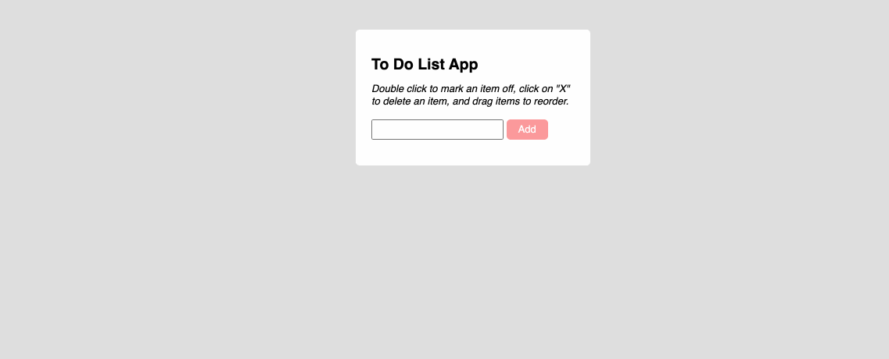

## To-Do-List App

Simple to-do-list app. This project is a web app using **HTML**, **CSS**, and **JavaScript** and was created as an exercise in order to learn the basics of **jQuery**.

Please click [this link](https://molleira.github.io/to-do-list-app/) to visit the website.

### About
As in many other tools similar to this one, the concept is very simple. Users can add new items to the list and can also delete items of the list.

### Development
To run this project on your device, open the index.html file in a browser.

### Usage
Please let me know if you would like to use this project as a template to create your personal portfolio. I'll be happy to get in touch and help with whatever you need.
